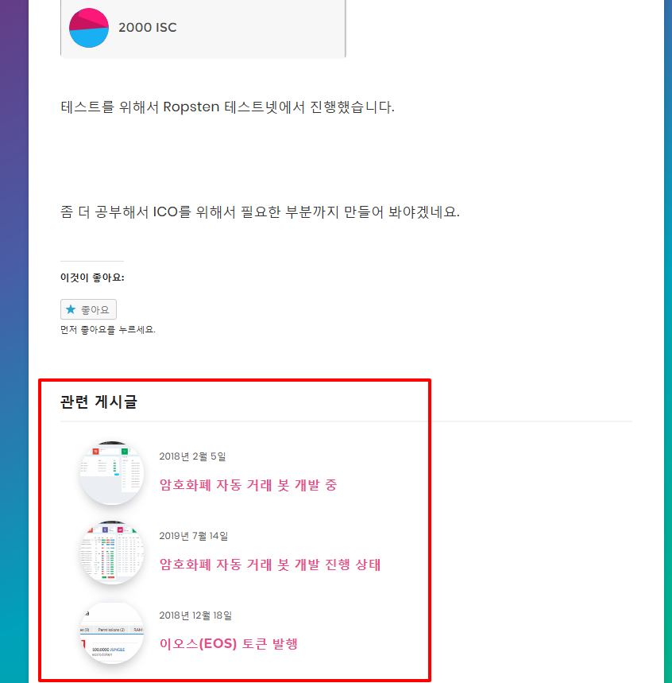

# yarpp-template-for-breek-theme
YARPP(Yet Another Related Posts Plugin) template for Breek theme with thumbnail and title list.

## Installation

- Upload theme file (yarpp-template-breek.php) to your themes folder (wp-content/themes/breek/).
- Select "Custom" and "Breek" as the template file in the "Yet Another Related Posts plug-in" settings.

## Dependencies

This template script requires the following plugin and theme.
- YARPP(Yet Another Related Posts Plugin) (https://wordpress.org/plugins/yet-another-related-posts-plugin/)
- Breek (https://themeforest.net/item/breek-minimal-masonry-theme-for-wordpress/24031994)

## Screenshots

